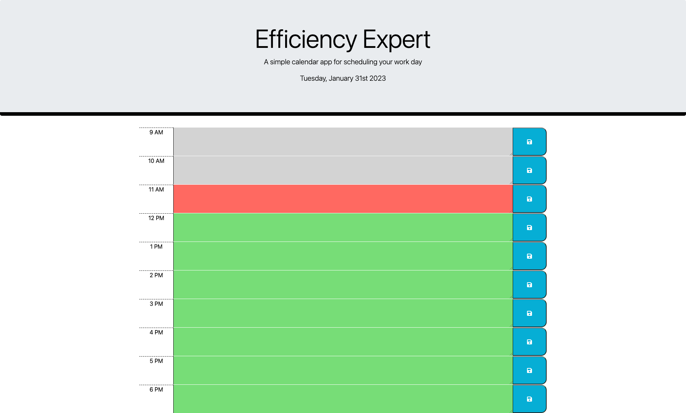

# EfficiencyExpert

    EfficiencyExpert is the ultimate solution for busy employees looking to streamline their workday. This simple yet powerful app helps you manage your tasks, track your time, and achieve your goals with ease. With its user-friendly interface, you can easily organize your schedule and prioritize your responsibilities. Customize the app to fit your specific needs and enjoy the peace of mind that comes with being fully in control of your workload. Try EfficiencyExpert today and experience a new level of productivity.

## Project Link/Deployed Application 👇

* You can try the live demo of the project at this [@Efficiency Expert](https://constantin-e-t.github.io/EfficiencyExpert/)

## Table of Contents 🔗

* [Description](#description)
* [Screenshots](#screenshots)
* [Authors](#authors)
* [Skills](#skills)
* [Stack](#stack)
* [License](#license)

## Description

* A simple day planner built using HTML, CSS, JavaScript, and jQuery.
* Displays current day and time dynamically in header.
* Rows are generated for working hours (9 AM - 6 PM) with a time label, a text area to enter notes, and a save button.
* Rows are color-coded to reflect past, present, and future time slots.
* Notes are stored in local storage and are persistent even after the page is reloaded.
* Alert message is displayed after a note is saved successfully.

## Screenshots

## Authors

* [@Constantin-E-T](https://github.com/Constantin-E-T/)

## Skills

    Javascript, HTML, CSS, Python, Django

## Stack

    * JavaScript(jQuery)
    * Bootstrap
    * HTML & CSS

## License

[MIT](https://choosealicense.com/licenses/mit/)